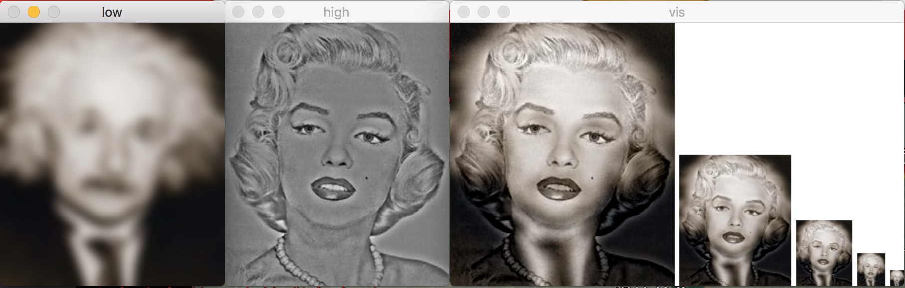

# Project Report

​                                      														*1155092206, TU Shuo*


In this project, I will implement the image hybrid through both "image convolution" and "Fast Fourier Transformation". 

#### Image padding

If we leave image intact, obviously, it is not convinient to do convolution operation between image and kernel function for the reason that we can not deal with pixel in the edge. So we need to pad Image so that we can do convolution completely. There are several methods to implement it.
We use  `np.vstack` and `np.hstack` provided by numpy,  which regard image segement as stack to implement three kinds of padding types:

* zero padding 
* replicate padding
* symetric padding

#### Image convolution

The image convolution is the kernel part of image hybrid. It has the function of low pass filter. Unfortunately, it costs a lot time to do convolution. Since it needs 4 loop. The kernel code is as below.

```python
for i in range(pad_w, pad_w+iw):
    for j in range(pad_l, pad_l+il):
        for m in range(-pad_w, pad_w+1):
            for n in range(-pad_l, pad_l+1):
                newImage[i][j][:] += image[i+m][j+n][:] * kernel[pad_w-m][pad_l-n] 
```
Through analysis, we can easily solve out the **time complexity of this algorithm is $O(mnpq)$** where m,n,p,q is the length and width of image and kernel function.

After convolution, we just catch the part of image to get the image of same size as original.

#### Hybrid image

After finishing convolution, the majority of this project is done. Then we need to do some basic operation to  image.

```python
low_frequencies = my_imfilter(image1, kernel)
high_frequencies = image2 - my_imfilter(image2, kernel)
hybrid_image = low_frequencies + high_frequencies
```
The logic of code is apparent. Using low pass filter to one image, and using high pass filter to the other image(actually I implement high pass filter by minus operation), and then combine them. Hopefully, we get the expected image.

What we need to pay attention to is that I modify some skeleton visualization code to make gray-scale image visualize as color image. 

#### Result Analysis

Here I select some results to analysis this project. 



 

Gray-scale image is also appliable in this code, as below.
 


#### FFT method and comparison

Through a lot of expriment of various image, I understand that convolution is really a huge cost for sake of time. So we want to attain the same result by using FFT. In handy, I define a new function to compare the result generated by two different function.  It is a little complex to do FFT in color image. We need seperate three colors and do FFT to them each other, and then we combine them together.

```python
def fft_imfilter(image, kernel):
    result = np.zeros(image.shape,np.complex128)
    for i in range(0,image.shape[2]):
        im = image[:,:,i]
        image_fre = np.fft.fft2(im)
        image_fre = np.fft.fftshift(image_fre)
        f = np.fft.fft2(kernel,im.shape)
        fshift = np.fft.fftshift(f)
        newImage_fre = image_fre * fshift
        newImage = np.fft.ifft2(np.fft.ifftshift(newImage_fre))
        result[:,:,i] = newImage
    return np.abs(result)
```
The result for comparison between two algorithm is suprising:

For the same pair images, same cutoff frequency

|             | user time | system time |
| ----------- | :-------- | ----------- |
| FFT         | 0m0.589s  | 0m0.272s    |
| Convolution | 5m54.027s | 0m3.426s    |

But, with plenty of time saved, the output image is not as good as image generated by convolution. The sample pair is as below:  

As we see, the image is not as good as the image above.
